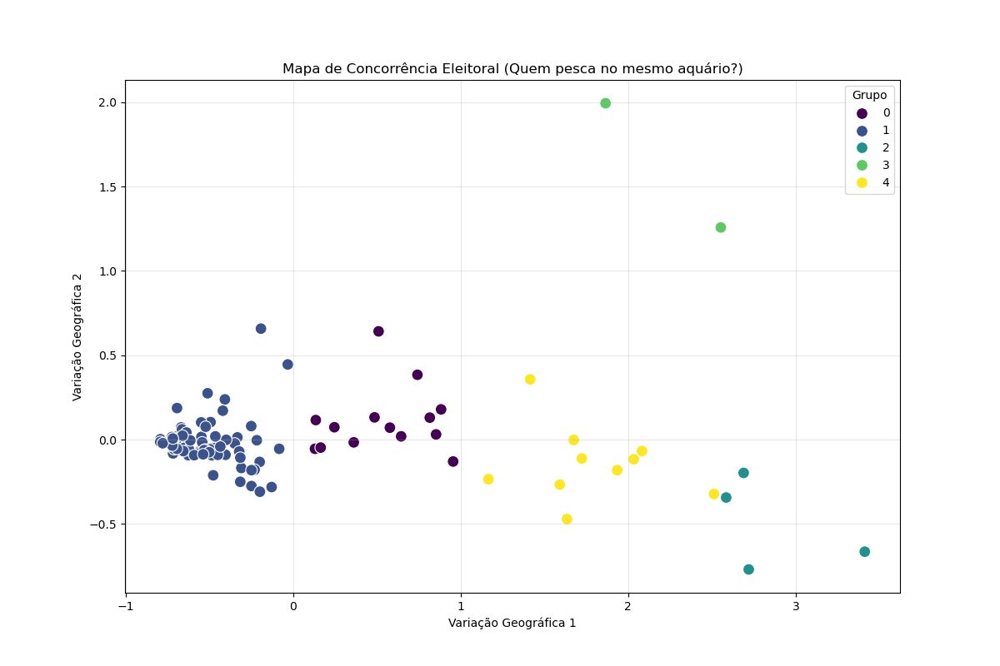

🗳️ Sistema de Inteligência e Análise de Dados Eleitorais

📄 Sobre o Projeto
Este projeto é uma ferramenta avançada de Data Science aplicada a dados eleitorais (Eleições Municipais 2024). O objetivo é transcender a totalização simples de votos, transformando dados brutos de Boletins de Urna (BU) em inteligência estratégica através de modelagem estatística e algoritmos de Machine Learning.

O sistema processa dados granulares (por seção eleitoral) para identificar padrões latentes de comportamento do eleitorado, segmentar perfis de candidatos e detectar anomalias estatísticas na distribuição de votos, oferecendo uma visão profunda da dinâmica territorial e partidária.

🚀 Funcionalidades Principais (Data & ML)
1. 🧠 Machine Learning Não Supervisionado (Clustering)
Utilizamos algoritmos para entender a competição territorial sem necessidade de dados rotulados.

Algoritmo: K-Means combinado com PCA (Análise de Componentes Principais) para redução de dimensionalidade.

Objetivo: Agrupar candidatos que possuem padrões geográficos de votação semelhantes. Isso permite identificar concorrentes diretos que disputam o mesmo "território" ou perfil de eleitorado.

2. 🕵️ Detecção de Anomalias Estatísticas
Aplicação de técnicas para identificar comportamentos que fogem do padrão normal da distribuição de dados do município.

Algoritmo: Isolation Forest (Floresta de Isolamento).

Objetivo: Detectar automaticamente seções eleitorais (urnas) que apresentam um padrão estatístico "estranho", caracterizado geralmente por uma combinação de baixíssima diversidade de votos (entropia) e dominância extrema de um único candidato.

3. 📊 Perfilamento Estratégico com Estatística Avançada
Uso de métricas econômicas e da teoria da informação adaptadas ao contexto político.

Coeficiente de Gini Eleitoral: Mede o grau de concentração dos votos de um candidato. Classifica matematicamente perfis como "Cacique de Bairro" (voto altamente concentrado geograficamente) versus "Voto de Opinião" (voto pulverizado na cidade).

Entropia de Shannon: Mede a "liberdade" ou diversidade do voto em cada seção. Seções com alta entropia indicam voto pulverizado/competitivo; baixa entropia indica voto concentrado/controlado.

4. ⚔️ Análise de Dinâmica Intra-Partidária
Share of Party (Canibalização): Calcula a dominância percentual de um candidato dentro dos votos da sua própria legenda, seção por seção. Identifica candidatos que "secam" o partido, concentrando quase 100% dos votos da legenda em seus redutos, versus aqueles que convivem com outros correligionários.

🛠️ Stack Tecnológica
Linguagem: Python 3.x

Manipulação de Dados: Pandas, NumPy, SciPy

Machine Learning: Scikit-learn (KMeans, PCA, Isolation Forest)

Visualização Interativa: Plotly Express/Graph Objects

Visualização Estática: Matplotlib, Seaborn

Banco de Dados/ORM: PostgreSQL, SQLAlchemy

📈 Visualizações e Análises Geradas
Abaixo estão exemplos reais das análises geradas pelo sistema, demonstrando o poder dos algoritmos aplicados aos dados brutos.

1. Mapa de Concorrência (Clustering K-Means + PCA)
Cada ponto é um candidato. Pontos próximos e da mesma cor indicam candidatos com desempenho geográfico semelhante, ou seja, concorrentes diretos pelo mesmo eleitorado territorial.

(Clusters identificando grupos de competidores diretos baseados na geografia do voto)

2. Matriz Estratégica (Coeficiente de Gini)
Classificação automática de candidatos baseada no total de votos (Eixo X) e na sua concentração geográfica medida pelo Gini (Eixo Y).

.png>)

Pontos Vermelhos/Laranja (Topo): Candidatos com alta dependência de poucos redutos ("Caciques de Bairro").

Pontos Azuis (Base): Candidatos com votos distribuídos pela cidade ("Voto de Opinião").

3. Detecção de Anomalias (Isolation Forest)
O gráfico cruza a dominância do vencedor da urna (Eixo X) com a entropia/diversidade da urna (Eixo Y).

.png>)

Pontos Vermelhos (Losangos): Seções marcadas pelo algoritmo como anomalias estatísticas. Elas fogem do padrão da cidade, apresentando alta concentração em um candidato e baixíssima diversidade geral.

4. Canibalização Intra-Partidária
Análise da força de um candidato dentro do próprio partido.

Bolinhas Vermelhas no topo: Indicam seções onde um único candidato obteve mais de 90% de todos os votos dados à sua legenda, demonstrando domínio absoluto e "canibalização" dos votos do partido naquele local.

5. Mapa de Liberdade do Voto (Entropia de Shannon)
Mede a diversidade de escolha em cada urna.

.png>)

Cores Verdes/Altas: Urnas com alta entropia, onde os votos foram bem distribuídos entre vários candidatos (ambiente competitivo).

Cores Vermelhas/Baixas: Urnas com baixa entropia, indicando concentração atípica de votos em poucos nomes.

⚙️ Como Executar

Pré-requisitos
Python 3.10+

PostgreSQL

Dependências listadas em requirements.txt